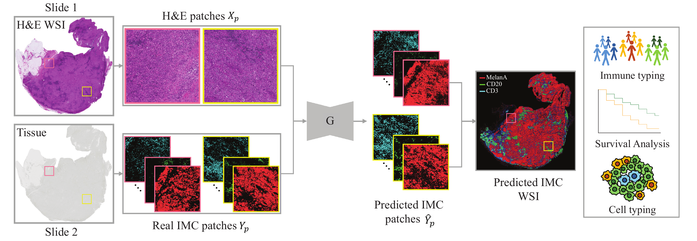

# HistoPlexer 

## HistoPlexer: Histopathology-based Protein Multiplex Generation using Deep Learning



**Abstract:** Multiplexed imaging technologies provide crucial insights into interactions between tumors and their surrounding tumor microenvironment (TME), but their widespread adoption is limited by cost, time, and tissue availability. We introduce HistoPlexer, a deep learning (DL) framework that generates spatially-resolved protein multiplexes directly from histopathology images. HistoPlexer employs the conditional generative adversarial networks with custom loss functions that mitigate slice-to-slice variations and preserve spatial protein correlations. In a comprehensive evaluation on metastatic melanoma samples, HistoPlexer consistently outperforms existing approaches, achieving superior Multiscale Structural Similarity Index and Peak Signal-to-Noise Ratio. Qualitative evaluation by domain experts demonstrates that the generated protein multiplexes closely resemble the real ones, evidenced by Human Eye Perceptual Evaluation error rates exceeding the 50\% threshold for perceived realism. Importantly, HistoPlexer preserves crucial biological relationships, accurately capturing spatial co-localization patterns among proteins. In addition, the spatial distribution of cell types derived from HistoPlexer-generated protein multiplex enables effective stratification of tumors into immune hot versus cold subtypes. When applied to an independent cohort, incorporating additional features from HistoPlexer-generated multiplexes enhances the performance of the DL model for survival prediction and immune subtyping, outperforming the model reliant solely on Hematoxylin & Eosin (H&E) image features. By enabling the generation of whole-slide protein multiplex from the H&E image, HistoPlexer offers a cost- and time-effective approach to understanding the TME, and holds promise for advancing precision oncology.

## Installation
First clone the repo and cd into the directory:
```shell
git clone https://github.com/ratschlab/HistoPlexer.git
cd HistoPlexer
```
Then create a conda env and install the dependencies:
```shell
conda env create -f environment.yml
conda activate histoplexer
```
## Running the code 
### Training 
For interactive jobs or to customize the submission script, use:

```bash
python -m bin.train --config_path src/config/sample_config.json

```
for running the training script.


```bash
python -m bin.train --config_path src/config/sample_config_fm.json

```
for running the training script using embeddings from foundation model. 


#### Configuration Settings

- `base_save_path`: Path where all experiments are saved. The experiment name .
- `src_folder`: Path containing source data.
- `tgt_folder`: Path containing target data.
- `split`: Directory of the data split csv file. First row has column names "train", "test", "valid". The remaining rows has 3 sample names for each of the train/test/valid splits.
- `markers`: List of all the markers in the data. The lenght should correspond to the channels in target folder. 
- `cohort`: Name of the cohort eg tupro/shift/deepliif1 etc. It is used in the name of the experiment that will be saved in `bas_save_path`. 
- `output_nc`: Correponds to the number of channels for data in `tgt_folder`. 
- `use_high_res`: True by default and False if src and tgt are of same width and height. 
- `channels`: Contains list of channel indices, used for running singleplex experiments. In config file if starts with underscore eg. `_channels` then it is ignored and all channels in `markers` are used. 
- `method`: Name of the method used. eg `ours`, `pix2pix`, `pyramidp2p`. The default setting for the methods is contained in `sample_config_grid.json` file.
- `device`: Cuda device to be used for the experiment. 
- `resume_path`: Path to the experiment from where the last saved checkpoint is used to resume the experiment. 


Additional configs for using foundation model
- `fm_features_path`: Path for h5 file containing the features from the foundation model. For this setup and run `bin/fm_embeddings.py` to get embeddings for HE images.  
- `fm_feature_size`: Size of feature vector from the foundation model. Eg 1024 for uni_v1, 1536 for uni_v2 1280 for virchow_v2.

### Inference 
```bash
python -m bin.inference
```
Can run inference 
and pass following arguments appropriately: 
- `checkpoint_path`: Full path to the exact pth file to be used for running the inference. 
- `src_folder`: Path to the HE numpy files for test set. 
- `tgt_folder`: Path to the ground truth IMC/IF images. 
- `mode`: Default test. 
- `measure_metrics`: If also do evaluation and measure metrics after inference eg MSSSIM, psnr, RMSE. Default True. 
- `markers`: Markers on which the experiment was run. Pass as `--markers CD16 CD20 CD3 CD31 CD8a gp100 HLA-ABC HLA-DR MelanA S100 SOX10`
- `get_predictions`: Pass this if want to run inference, else only evaluation is performed.  
- `save_path`: If predictions already saved and only need to run evaluation, then provide path for the saved predictions. 
- `split`: Directory of the data split csv file. First row has column names "train", "test", "valid". The remaining rows has 3 sample names for each of the train/test/valid splits.

Example run for ours/pix2pix/pyramidp2p
```bash
python -m bin.inference --checkpoint_path=/home/user/histoplexer/tupro_ours_channels-all_seed-0/checkpoint-step_500000.pt --get_predictions
```

Example inference run for using our model: 
```bash
python -m bin.inference --checkpoint_path=/home/user/histoplexer/tupro-patches_ours_channels-all_seed-0/checkpoint-step_300000.pt \
                        --get_predictions \
                        --src_folder=/home/user/histoplexer/tupro/he_rois_test/binary_he_rois_test \
                        --test_embeddings_path=/home/user/histoplexer/he_rois_test/embeddings-uni_v1.h5 \
                        --tgt_folder=/home/user/histoplexer/tupro/binary_imc_processed_11x                        
```

### Downstream tasks 

<!-- Details about our model architecture and implementation can be found in our [preprint](). If you use this code, please consider citing our work: -->


## Downloading Ultivue dataset 
Manuscript under review. Available upon acceptance.
